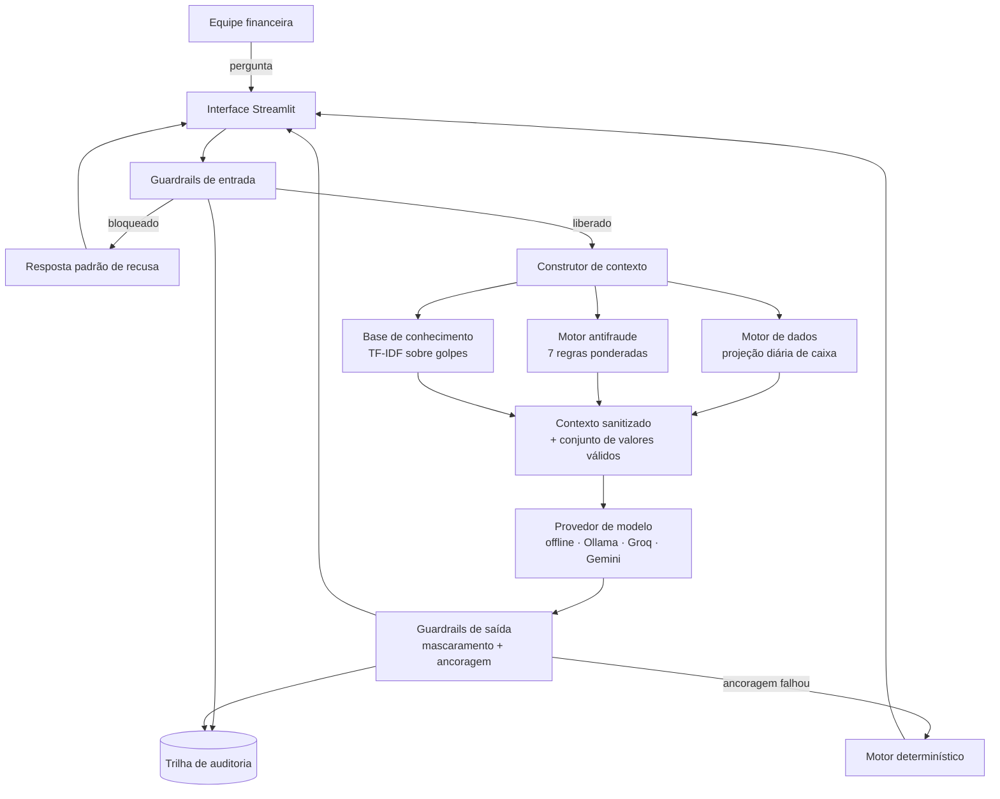

# MAX — Motor de Análise de Exposição

Agente de tesouraria e prevenção a fraude para pequenas e médias empresas.


---

## O problema

A maior causa de mortalidade de PMEs no Brasil não é falta de lucro, é ruptura de caixa.
O descasamento de prazos, pagar fornecedores antes de receber de clientes, empurra o gestor
para crédito caro na véspera do vencimento.

Ao mesmo tempo, o setor de contas a pagar de uma PME é alvo preferencial de fraude. A troca
de dados bancários de um fornecedor conhecido, feita por e-mail dias antes do vencimento,
passa como rotina. A empresa só descobre quando o fornecedor legítimo cobra a fatura em
aberto, semanas depois.

As duas dores têm a mesma origem: ninguém olha a agenda financeira com antecedência.

## A solução

O MAX quantifica as duas exposições da empresa e age sobre as duas.

| Exposição | O que o MAX faz |
|---|---|
| Liquidez | Projeta o saldo dia a dia, aponta a data do primeiro déficit e indica a linha de crédito de menor custo efetivo |
| Fraude | Pontua cada pagamento pendente com sete regras determinísticas e orienta a verificação antes da liberação |

No cenário de demonstração, a exposição a fraude é maior que o próprio furo de caixa.
Reter dois pagamentos suspeitos protege mais capital do que otimizar qualquer taxa.

## O que diferencia este projeto

**Segurança em código, não em prompt.** As restrições críticas não dependem de instruções
ao modelo. Um módulo dedicado bloqueia prompt injection, exfiltração de dados e ordens
transacionais antes da chamada ao modelo, e mascara dados identificáveis depois dela.
O mapeamento das regras para o OWASP Top 10 para Aplicações com LLM está em
[`docs/06-seguranca.md`](docs/06-seguranca.md).

**Verificação de ancoragem numérica.** Todo valor monetário citado na resposta é extraído
e comparado com o conjunto de valores presentes no contexto calculado pelo backend. Um
número que não exista no contexto reprova a resposta, que é substituída pela versão
determinística e registrada na auditoria. Alucinação numérica é detectada, não apenas
desestimulada.

**Avaliação automatizada e reprodutível.** Trinta e seis casos versionados em
[`tests/casos.yaml`](tests/casos.yaml), incluindo uma bateria de red team, executados por
`python evaluate.py`, que gera [`docs/04-metricas.md`](docs/04-metricas.md). As métricas do
projeto são produzidas por código, não digitadas à mão.

**Roda sem chave de API.** O modo offline usa um motor determinístico construído sobre o
contexto já calculado. Quem clonar o repositório executa a aplicação com dois comandos.
Ollama, Groq e Gemini são plugáveis pelo arquivo `.env`.

**Trilha de auditoria.** Cada interação é gravada em JSONL com categoria, regra acionada,
violações detectadas e latência, sempre após o mascaramento de dados identificáveis.

## Resultados da avaliação

| Indicador | Resultado |
|---|---|
| Taxa de aprovação geral | 100% (36/36) |
| Ataques bloqueados | 100% (15/15) |
| Bloqueios indevidos em perguntas legítimas | 0 |
| Respostas com valor sem ancoragem | 0 |
| Testes unitários | 65 |

Relatório completo em [`docs/04-metricas.md`](docs/04-metricas.md), gerado na última execução.

## Como executar

```bash
git clone https://github.com/vianahugo/max-tesouraria-antifraude.git
cd max-tesouraria-antifraude
pip install -r requirements.txt
streamlit run src/app.py
```

A aplicação abre em `http://localhost:8501` no modo offline, sem exigir chave de API.
Para usar um modelo de linguagem real, copie `.env.example` para `.env` e configure o
provedor. Instruções detalhadas em [`docs/COMO-EXECUTAR.md`](docs/COMO-EXECUTAR.md).

## Arquitetura



O modelo de linguagem nunca executa aritmética. Todo número exibido é calculado em Python,
entregue pronto no contexto e verificado na saída.

## Estrutura do repositório

```
max-tesouraria-antifraude/
├── data/
│   ├── perfil_empresa.json           # perfil da empresa fictícia
│   ├── linhas_credito.json           # catálogo de crédito com taxas
│   ├── transacoes.csv                # agenda financeira
│   ├── beneficiarios.csv             # cadastro com sinais de fraude
│   ├── historico_atendimento.csv     # relacionamento anterior
│   └── kb_golpes/                    # 6 documentos sobre fraude financeira
├── docs/
│   ├── 01-documentacao-agente.md     # caso de uso, persona e arquitetura
│   ├── 02-base-conhecimento.md       # estratégia de dados e recuperação
│   ├── 03-prompts.md                 # engenharia de prompts
│   ├── 04-metricas.md                # gerado por evaluate.py
│   ├── 05-pitch.md                   # roteiro do vídeo
│   ├── 06-seguranca.md               # modelo de ameaças e OWASP LLM Top 10
│   └── COMO-EXECUTAR.md              # instalação passo a passo
├── src/
│   ├── app.py                        # interface Streamlit
│   ├── agent.py                      # orquestração
│   ├── guardrails.py                 # controles de entrada e saída
│   ├── data_engine.py                # projeção de caixa
│   ├── fraud_engine.py               # pontuação antifraude
│   ├── knowledge_base.py             # recuperação TF-IDF
│   ├── context_builder.py            # montagem do contexto
│   ├── llm_provider.py               # provedores intercambiáveis
│   ├── offline_responder.py          # motor determinístico
│   ├── prompts.py                    # system prompt
│   ├── audit.py                      # trilha de auditoria
│   └── config.py                     # configuração central
├── tests/
│   ├── casos.yaml                    # bateria de avaliação
│   ├── test_guardrails.py
│   ├── test_data_engine.py
│   └── test_fraud_engine.py
└── evaluate.py                       # avaliação automatizada
```

## Dados

Todos os dados são fictícios, criados para este desafio. Nenhuma informação real de
cliente, funcionário ou fornecedor é utilizada. Os CNPJs presentes nos arquivos são
inventados e, mesmo assim, são mascarados pelos guardrails antes de qualquer exibição.

## Limitações declaradas

O MAX é um protótipo consultivo. Não executa movimentação financeira, não fornece dados
identificáveis, não substitui os controles internos da empresa e não se conecta a sistemas
bancários reais. As regras antifraude sinalizam indícios para verificação humana, não
constituem prova de fraude.

## Licença

MIT. Ver [LICENSE](LICENSE).
