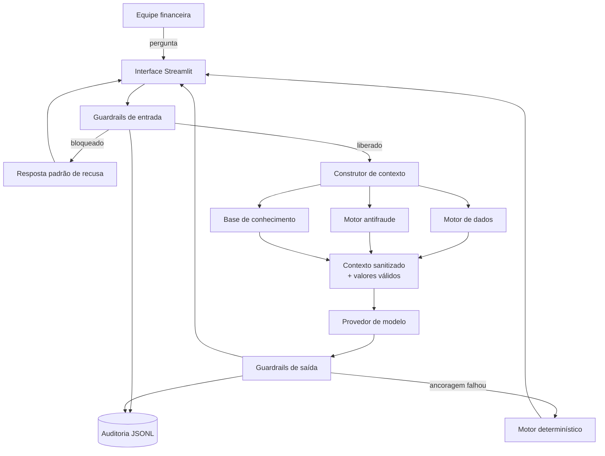

# Documentação do Agente

## Caso de uso

### Problema

Duas dores atingem o mesmo setor de uma pequena ou média empresa e têm a mesma causa
raiz, que é a ausência de visão antecipada da agenda financeira.

A primeira é o descasamento de prazos. Obrigações com data fixa, como folha de pagamento,
aluguel e fornecedores, vencem antes da entrada de recebíveis de cartão e boletos a prazo.
Sem projeção diária, o gestor descobre o furo no dia do vencimento e recorre ao crédito
disponível mais rápido, que costuma ser o mais caro. A diferença entre antecipar
recebíveis a 1,85% ao mês e usar cheque especial a 8,90% ao mês corrói a margem de uma
operação saudável.

A segunda é a fraude no contas a pagar. O setor financeiro de uma PME raramente tem
segregação de funções, e a rotina de pagamentos absorve alterações cadastrais sem
verificação independente. A fraude do falso fornecedor, em que o criminoso troca os dados
bancários de um credor conhecido pouco antes do vencimento, explora exatamente essa
rotina. O pagamento sai normalmente e o prejuízo só aparece semanas depois.

### Solução

O MAX quantifica as duas exposições e atua sobre as duas na mesma tela.

Na exposição de liquidez, o motor de dados recalcula o saldo acumulado a cada lançamento
do horizonte, identifica a primeira data negativa, o pior saldo do período e a necessidade
exata de cobertura. Sobre esse número, seleciona a linha de crédito de menor custo efetivo
com limite suficiente e apresenta o custo em reais frente à alternativa mais cara.

Na exposição a fraude, o motor antifraude aplica sete regras ponderadas a cada pagamento
pendente, cruzando a transação com o cadastro do beneficiário. Data da última alteração de
conta, canal da solicitação, divergência entre titular e razão social, histórico de valores
e alçada de aprovação produzem uma pontuação de 0 a 100 e uma classificação de risco.

As duas análises se combinam: a projeção de caixa é calculada em dois cenários, com e sem
os pagamentos suspeitos retidos, o que mostra ao gestor o impacto real de segurar uma
operação duvidosa.

Além de analisar, o agente orienta. Uma base de conhecimento sobre golpes que atingem
empresas responde perguntas práticas de prevenção, o que atende à frente de cibersegurança
como conteúdo prevista no desafio.

### Público-alvo

Responsável financeiro, controller e sócio-administrador de empresa de pequeno e médio
porte que acumula a gestão de tesouraria com outras funções e não dispõe de equipe
dedicada a controles internos.

---

## Persona e tom de voz

### Nome

MAX, sigla de Motor de Análise de Exposição.

### Personalidade

O MAX é analítico e direto. Não vende produto, apresenta números e a decisão que decorre
deles. Quando aponta um risco, informa a regra que o gerou e o que fazer a respeito, porque
um alerta sem instrução de verificação apenas transfere ansiedade ao gestor.

Prioriza contenção de perda sobre otimização de custo. Se há um pagamento suspeito na
agenda, ele trata esse ponto antes de discutir taxa de crédito, pela razão simples de que
reter uma fraude protege mais capital do que economizar juros.

Reconhece o limite do próprio conhecimento. Quando o dado não está no contexto, diz que
não possui a informação, em vez de estimar.

### Tom de comunicação

Profissional e objetivo, com terminologia correta de mercado, custo efetivo total, D+0,
alçada, recebível, sempre convertendo percentual em impacto em reais. Máximo de três
parágrafos curtos ou cinco itens por resposta.

### Exemplos de linguagem

Abertura proativa:

> Revisei a agenda financeira da empresa. Encontrei 2 pagamentos com indícios de fraude,
> somando R$ 41.100,00. Recomendo tratar esses lançamentos antes de qualquer decisão de
> crédito.

Alerta de risco:

> TRX-005, pagamento à Transportadora Rota Norte, R$ 18.700,00. Classificação CRÍTICO.
> A conta bancária foi alterada há 4 dias por e-mail e o titular informado diverge da
> razão social. Retenha o pagamento e confirme por telefone em número que já estava no
> cadastro antes desta solicitação.

Recusa de execução:

> Não executo movimentação financeira. Posso projetar o impacto da operação no caixa e
> revisar os dados do beneficiário antes que você autorize no canal oficial do banco.

Limite de escopo:

> Esse tema está fora do meu escopo. Atuo em tesouraria, fluxo de caixa, custo de crédito
> e segurança contra fraudes financeiras da empresa.

---

## Arquitetura

### Componentes

| Componente | Arquivo | Responsabilidade |
|---|---|---|
| Interface | `src/app.py` | Painel de caixa, chat, painel de segurança e trilha de auditoria em Streamlit |
| Orquestração | `src/agent.py` | Encadeia guardrails, contexto, modelo e auditoria em uma única passagem |
| Guardrails | `src/guardrails.py` | Classificação da entrada, mascaramento de PII e verificação de ancoragem na saída |
| Motor de dados | `src/data_engine.py` | Carregamento, deslocamento evergreen de datas, projeção diária e seleção de crédito |
| Motor antifraude | `src/fraud_engine.py` | Sete regras ponderadas, pontuação e orientação de verificação |
| Base de conhecimento | `src/knowledge_base.py` | Indexação e recuperação TF-IDF dos documentos sobre golpes |
| Construtor de contexto | `src/context_builder.py` | Serialização do contexto e do conjunto de valores válidos |
| Provedores | `src/llm_provider.py` | Interface comum para offline, Ollama, Groq e Gemini |
| Motor determinístico | `src/offline_responder.py` | Resposta composta a partir do contexto, sem inferência |
| Auditoria | `src/audit.py` | Registro JSONL e estatísticas de segurança |

### Fluxo de uma interação

1. A mensagem passa pelos guardrails de entrada. Se for classificada como prompt injection,
   exfiltração ou ordem transacional, a execução para e a resposta padrão de recusa é
   devolvida com registro na auditoria.
2. O construtor de contexto recalcula a projeção de caixa nos dois cenários, aplica as
   regras antifraude e recupera até dois trechos da base de conhecimento relacionados à
   pergunta.
3. O contexto é sanitizado, removendo identificadores diretos, e serializado em texto.
   Em paralelo, é montado o conjunto de valores monetários válidos daquela sessão.
4. O provedor de modelo recebe o system prompt e o contexto. No modo offline, o motor
   determinístico compõe a resposta a partir do mesmo contexto.
5. A resposta passa pelos guardrails de saída. Dados identificáveis são mascarados e todo
   valor monetário citado é conferido contra o conjunto de valores válidos. Se um valor não
   for encontrado, a resposta é descartada e substituída pela versão determinística.
6. O registro final é gravado na trilha de auditoria com categoria, regra, violações,
   latência e resultado da ancoragem.

---

## Segurança e anti-alucinação

### Estratégias adotadas

- **Cálculo determinístico.** O modelo de linguagem não executa aritmética. Toda projeção,
  taxa e custo é calculado em Python e entregue pronto no contexto.
- **Verificação de ancoragem numérica.** Valores monetários da resposta são extraídos por
  expressão regular e comparados com o conjunto de valores presentes no contexto. Um valor
  ausente reprova a resposta.
- **Substituição segura em caso de falha.** Quando a ancoragem falha, a resposta do modelo
  é descartada e o motor determinístico assume, garantindo que o usuário nunca veja um
  número inventado.
- **Mascaramento de dados identificáveis.** CNPJ, CPF, cartão, agência e conta, chave Pix,
  e-mail e telefone são substituídos por marcadores neutros na saída e antes do envio do
  contexto ao provedor.
- **Bloqueio de ordens transacionais em código.** A recusa de executar Pix, pagamento,
  contratação de crédito e alteração cadastral não depende do prompt.
- **Contenção de escopo.** Perguntas fora de tesouraria, crédito e segurança financeira
  recebem recusa explícita com reorientação.
- **Trilha de auditoria.** Todo evento é registrado, o que permite medir a eficácia dos
  controles em vez de presumi-la.

O detalhamento das ameaças e o mapeamento para o OWASP Top 10 para Aplicações com LLM estão
em [`06-seguranca.md`](06-seguranca.md).

### Limitações declaradas

- Não executa movimentação financeira de qualquer natureza.
- Não fornece dados que identifiquem pessoas físicas ou jurídicas, nem valores individuais
  de folha de pagamento.
- Não recomenda investimentos, produtos de renda variável ou criptoativos.
- Não altera limites de crédito nem cadastros.
- Não se conecta a sistemas bancários reais. Opera sobre arquivos locais fictícios.
- As regras antifraude indicam indícios que exigem verificação humana. Não constituem
  prova de fraude nem substituem a política interna de controles da empresa.
